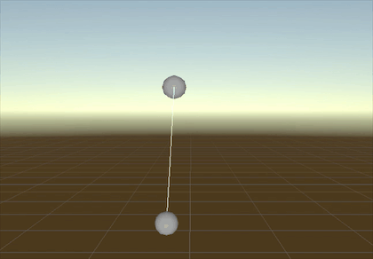
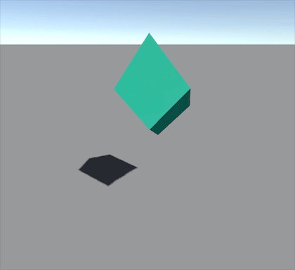
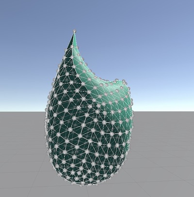
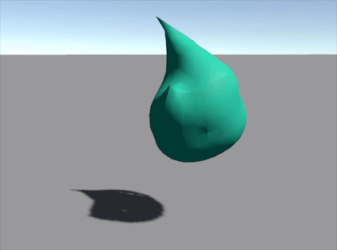
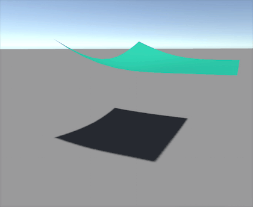
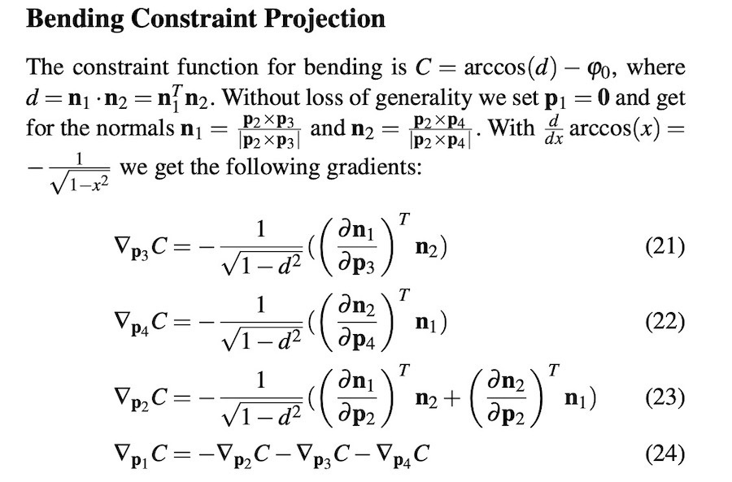

# XPBD Simulation with Rust & Unity

上次看了XPBD的论文，最近又恰好在学习Rust，于是就想着用Rust来实现一个XPBD Solver练一下手，正好一箭双雕。

XPBD结论公式可参考此篇 - [XPBD论文解读(Extended Position-Based Dynamics)
](https://zhuanlan.zhihu.com/p/406652407)

本文将在以上的公式基础上，侧重于代码上的实现。具体而言就是使用Rust编写一个简单的XPBD Solver动态库供Unity侧调用。

这个版本的实现是比较粗糙的，主要目的是学习一下Rust语法，同时用代码走一遍XPBD算法流程。 所以在后面的约束构建上是比较随意的，最终效果也不是很好，以下的功能都没有:

- 没有阻尼
- 没有自碰撞
- 没有完善的物理碰撞反馈
- 没有静止Sleep

请谨慎参考

# XPBD Solver

首先介绍一下用法，要创建一个XPBD Solver，需要提供以下的初始数据:

- 所有质点的位置数据
- 所有质点的质量数据
- 时间步长
- 约束求解迭代次数
- 系统的约束数据
- 碰撞弹性系数
- 动摩擦系数

以创建一个简单的由两个质点、一个距离约束构成的XPBD系统为例，在rust中的代码如下

```rust
let positions = vec![point![0., 0., 0.], point![1., 0., 0.]];
let masses = vec![1., 1.];
let stiffness_inv = 0.0;
//约束信息
let constraints = vec![DistanceConstraint::new(0, 1, stiffness_inv)];
let mut xphd = XPBDBuilder {
    dt: 0.005, //时间步长
    constraints: constraints,
    positions: positions,
    masses: masses,
    iterate_count: 4, //约束求解迭代次数
    bounciness: 1.0,
    dynamic_friction_factor: 1.0,
}
.build();
//重力
xphd.add_acceleration_field(vector![0., -9.8, 0.]);
//固定住一个点
xphd.attach(0, point![0., 0., 0.]);
```

相应的，在Unity中也提供了c#版的api。以上的代码在Unity中运行效果如下(gif有加速):




传说中xpbd可以实现系统的迭代次数不影响刚性度表现，因此我们可以对比一下不同的迭代次数下，Chain的模拟效果:


三根Chain的节点数为10，stiffness_inv为0.005，从左至右IteratorCount依次为4、8、12。 可以看出来对迭代次数对Chain的刚性度几乎没有影响。

为了做更多的测试，写了一个简单的脚本SoftBodyMesh，可以依据任意Mesh拓扑结构创建XPBD系统，具体原理为:

- 将每个顶点视作质点
- 依照三角形的每个边构建距离约束
- 相邻的两个三角形构建弯曲约束

通过该算法构建的SoftBodyMesh，有其局限性，一方面复杂模型顶点众多，且拓扑结构不一定对求解友好。另一方面，仅仅依靠相邻质点进行约束在某些情况下也会显得有些力不从心。

如果要做比较好的软体模拟，通常需要加入体积约束。

在Unity默认的Cube上添加SoftBodyMesh脚本后的效果:




在Unity的Sphere上添加SofeBodyMesh效果,表面的约束拓扑结构如下:



迭代数值不太稳定。



圆柱体效果


对Unity内置Plane添加SoftBodyMesh脚本，就变为了一块布:




# 2. 关于稳定性的一些问题


在[1]中，我们已经给出了约束求解的两个关键公式:

$$
\Delta \lambda_i = \frac{-(\tilde{\alpha}_{ii}\lambda_i + C_i)}{(\nabla C_iM^{-1}\nabla C_i^T + \tilde{\alpha}_{ii})} , i \in [1,m] \tag{1}
$$

$$
\Delta x_j = \frac{\sum_{i=1}^m \nabla C^T_{ji}\Delta \lambda_i}{m_j}, j \in [1,n] \tag{2}
$$


为了计算以上的公式，约束必须给出一些实现，例如:

- 约束函数的定义 - 即$C(x)$
- 约束梯度的求解 - 即$\nabla C(x)$

一开始我是按照通用的思路去实现的。每个约束只要实现自己的$C(x)$和$\nabla C(x)$函数，注册到XPBDSolver中即可进行解算。

但在实际操作中发现这种方式会出现一些奇异点,导致迭代炸掉。以弯曲约束为例:



当两个三角面折角为180度时，d为1，这会导致(21)-(24)式分母为0，计算过程中就会出现无穷大。 因此为每个约束实现$C(x)$和$\nabla C(x)$函数似乎不太妥。

当我们推算出约束的$C(x)$和$\nabla C(x)$公式时，更好的方法是将公式代入(1)和(2)中继续化解。例如对弯曲约束来说，如果我们将(21)-(24)代入到(1)、(2)中，就会成功将 $\sqrt{1-d^2}$翻转到分子上，从而避免分母为0.

另一方面，继续代入化解也能提升计算性能。以距离约束为例，其以下是永远成立的

$$
\nabla C_iM^{-1}\nabla C_i^T == M^{-1}
$$

在rust中，为了实现以上优化，用到了**泛型特化**功能。目前只在nightly版本中支持。泛型特化允许我们针对指定类型提供独特的函数实现。

但是到目前为止，通过SoftBodyMesh构建的复杂物体约束，迭代稳定依旧不足。经过测试，与以下参数相关:

- stiffness_inv为0时，复杂约束系统无法保持稳定，会炸掉，但是简单约束系统可以保持稳定
- 单个质点的mass过小时，复杂约束系统无法保持稳定

也许继续优化公式能够进一步提升稳定性，但我没有继续研究了。


# 项目地址

最近工作比较忙，文章就越写越短了，请大家自己看源码吧:


